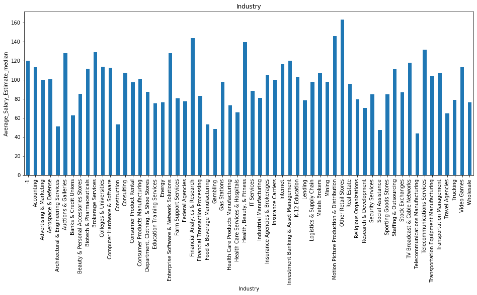
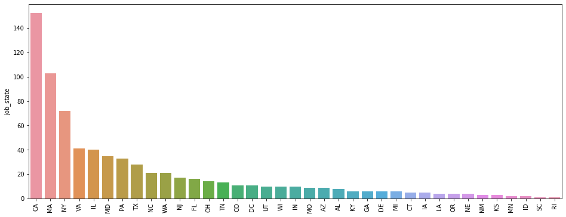
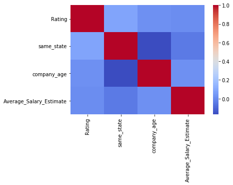
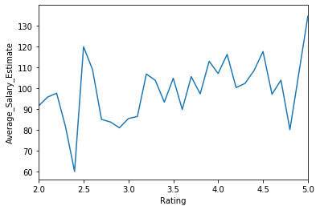

# Data science Salary Estimator
Now a days the demand for data scientist have increased and many different companies are hiring Machine learning and Deep learning practitioner, giving different roles in their companies, assigning different titles and providing wide range salary

This is my small contribution towards data scientist community to understand different types of role assigned and the expected salary being offered to them

## Project Overview

* Web scrapped the data from glassdoor.com
* Cleaned the dataset and extracted relevent columns
* Did exploratory data analysis to get the insight from data
* Feature engineered some of the columns 
* Build the Machine learning model 
* Get the model into production using Flask api

## Code and Resources Used
  **Python Version :** 3.8  
  **Packages :** pandas, numpy, sklearn, statsmodels, scipy, matplotlib, seaborn, feature-engine, selenium, flask, json, joblib  
  **For Web Framework Requirements :** pip install -r requirements.txt  
  **Scraper Github :** [GitHub](https://github.com/arapfaik/scraping-glassdoor-selenium)  
  **Scraper Article :** [Towards Data Science](https://towardsdatascience.com/selenium-tutorial-scraping-glassdoor-com-in-10-minutes-3d0915c6d905)  
  **Project Motivation :** [Ken Jee](https://www.youtube.com/channel/UCiT9RITQ9PW6BhXK0y2jaeg)  
  **Flask Productionization :** [Towards Data Science](https://towardsdatascience.com/productionize-a-machine-learning-model-with-flask-and-heroku-8201260503d2)  
## Web Scraping 
  Web scraped data from website : [Glassdoor](https://www.glassdoor.co.in/index.htm)  
  
  With each Search we get the followings :  
  1. Job Title 
  2. Salary Estimate
  3. Job Description
  4. Rating
  5. Company Name
  6. Location
  7. Headquarters
  8. Size
  9. Founded
  10. Type of ownership
  11. Industry
  12. Sector
  13. Revenue
  14. Competitors
  ## Data Cleaning 
  After extracting data from website, i cleaned the data and extracted usefull information to make it usable for model building.  
  
  Work I performed :
  * Deleted rows without salary
  * Parsed numeric part from Salary Estimate
  * Made new columns for employeer's provided salary and hourly wages 
  * Separated company's rating form company name
  * Made column for state capturing information about job location
  * Made a binary indicator column indicating if the job was at the company's headquarter
  * Transformed founded date into age of company
  * Encoded types of ownerships into widely used umbrella terms
  * Extracted most demanded skills from job discreption:
  
     * python
     * R
     * excel 
     * sas
     * spark
     * tableau
     * aws
     * big data
   
   * Column for simplified job title and Seniority
   ## Exploratory Data Analysis
   I went through distribution of numeric variables and frequency labels of different categorical variables. Found the relationship between different variables among themselves, made pivot tables and ploted graphs 
   
   Few key highlights of my findings :
     
       Job Title                 | Average Salary    seniority | Average Salary    job_state | Average Salary
       -------------------       |---------------    --------- |---------------    --------- |---------------
       Director                  | 168.833333        Senior    | 121.686364         CA       | 123.513158
       Machine learning Engineer | 119.958333        na        | 93.745935          IL       | 116.662500 
       Data Scientist            | 108.312785        Associate | 79.907407          DC       | 110.181818
       Manager                   | 107.285714        Jr        | 71.000000          MA       | 107.412621
       Data Engineer             | 105.403361                                       NJ       | 104.558824  
       na                        | 93.854167                                        MI       | 100.250000
       Data Analyst              | 70.060150                                        RI       | 100.000000
                                                                                    NY       | 98.652778     
                                                                                    NC       | 98.452381
                                                                                    MD       | 97.357143

## Feature Engineering and variable selection

I have made two datasets, one with the dummy variables and other one with the engineered variables.
Before performing feature engineering, I have splited the dataset into train and test set  

Feature engineering steps I performed :
* Rare label encoding of categorical variables by keeping the threshold to 0.03  
* Integer Encoding of categorical variables to get the monotonic relationship  
* Yeo-Johnson transformation of continuous variables to make the variable distribution close to gaussian distribution.   

##### Before transformation

##### After transformation

## Model Building
I trained the Multiple Linear Regression model with dataset having dummy variables just to get an idea of what are the most influential variables  
With engineered dataset I tried three different models and evaluated them using Mean Absolute Error. I choose MAE because it is relatively easy to interpret and outliers aren’t particularly bad in for this type of model.

##### Models :
**Multiple Linear Regression** : Baseline for the model  
**Lasso Regression** : As the cardinality of categorical variables were high, so i thought regularized linear regression like lasso would be effective.  
**Random Forest** : With the sparsity associated with the data, I thought that the tree based models would be a good fit.  
**Gradient Boost** : Just to compare the booststrap sampling and the bagging technique. 

## Model performance
The Gradient Boost model far outperformed the other approaches on the test and validation sets.

**Gradient Boost** : MAE = 13.56  
**Random Forest** : MAE = 14.86  
**Lasso Regression** : MAE = 18.14 

## Productionization

In this step, I built a flask API endpoint that was hosted on a local webserver by following along with the TDS tutorial in the reference section above. The API endpoint takes in a request with a list of values from a job listing and returns an estimated salary.
